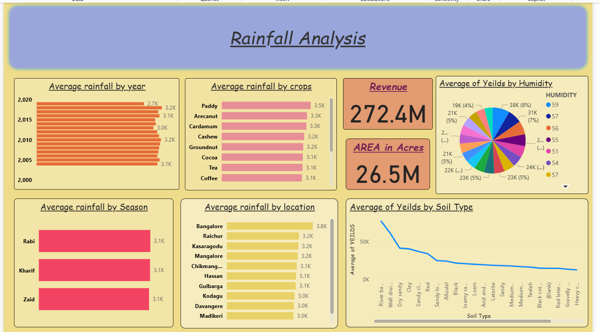

# 🌾 Agricultural Analysis using AWS, Snowflake, and Power BI

This project outlines the complete workflow for performing data analysis on agricultural datasets using Amazon S3, Snowflake, and Power BI. The goal is to build an interactive dashboard that provides insights into agricultural trends by integrating cloud storage, data warehousing, and business intelligence tools.

---



---

## 🛠️ Prerequisites

Before starting, make sure you have the following:

- ✅ An **AWS Account** with access to S3 and IAM services
- ✅ A **Snowflake Account** with admin privileges
- ✅ **Power BI Desktop** installed
- ✅ Basic knowledge of SQL, AWS IAM, and Power BI

---

## 📁 1. Creating Amazon S3 Bucket & Uploading Data

We begin by storing our agricultural dataset in Amazon S3:

1. Login to the **AWS Console**, and go to the **S3** service.
2. Click **Create Bucket** and use a lowercase name (e.g., `powerbi.project`).
3. Open the bucket and click **Upload**.
4. Upload your dataset file (e.g., `data_season.csv`).

📌 *This bucket acts as a staging point for Snowflake to ingest data.*

---

## 🔐 2. Creating IAM Role for Snowflake Integration

To allow Snowflake to access S3 securely:

1. Navigate to **IAM** → **Roles** → **Create Role**.
2. Choose **AWS Account**, and generate a random **external ID**.
3. Attach **AmazonS3FullAccess** policy.
4. Name the role (e.g., `powerBI.role`) and create it.
5. Copy the **Role ARN** for use in Snowflake.

---

## ❄️ 3. Creating Integration Object in Snowflake

In Snowflake console:

1. Run SQL to create an integration object:
   ```sql
   CREATE STORAGE INTEGRATION PBI_integration
   TYPE = EXTERNAL_STAGE
   STORAGE_PROVIDER = S3
   ENABLED = TRUE
   STORAGE_AWS_ROLE_ARN = '<your_role_arn>'
   STORAGE_ALLOWED_LOCATIONS = ('s3://powerbi.project/');
   ```
2. Go back to AWS → IAM → **Edit Trust Policy** of the created role.
3. Insert the **ARN** and **external ID** from Snowflake’s response to finalize trust.

📌 *This step securely connects Snowflake with your S3 bucket.*

---

## 📥 4. Loading Data into Snowflake

1. In Snowflake, create:
   - A **database** (e.g., `power_bi`)
   - A **schema** (e.g., `pbi_data`)
   - A **table** to match CSV structure

2. Create an **external stage**:
   ```sql
   CREATE STAGE s3_stage
   STORAGE_INTEGRATION = PBI_integration
   URL = 's3://powerbi.project/';
   ```

3. Load data using:
   ```sql
   COPY INTO PBI_dataset
   FROM @s3_stage/data_season.csv
   FILE_FORMAT = (TYPE = 'CSV' FIELD_OPTIONALLY_ENCLOSED_BY = '"' SKIP_HEADER = 1);
   ```

4. Validate with:
   ```sql
   SELECT COUNT(*) FROM PBI_dataset;
   ```

---

## 🔍 5. Data Profiling & Visualization in Snowflake

Analyze and understand data trends:

- Use `SELECT` queries to explore fields (e.g., year, area, rainfall).
- In Snowflake UI, enable **Chart View** for visual inspection.
- Identify nulls, blanks, min/max values.
- Example:
  ```sql
  SELECT year, COUNT(*) FROM PBI_dataset GROUP BY year ORDER BY year;
  ```

---

## 🧪 6. Transforming Data in Snowflake SQL

Create a copy and transform:

1. Duplicate the dataset:
   ```sql
   CREATE TABLE agriculture AS SELECT * FROM PBI_dataset;
   ```

2. Modify values:
   - Increase rainfall:
     ```sql
     UPDATE agriculture SET rainfall = 1.1 * rainfall;
     ```
   - Decrease area:
     ```sql
     UPDATE agriculture SET area = 0.9 * area;
     ```

3. Add and populate `year_group`:
   ```sql
   ALTER TABLE agriculture ADD year_group VARCHAR;

   UPDATE agriculture SET year_group = 'y1' WHERE year BETWEEN 2004 AND 2009;
   UPDATE agriculture SET year_group = 'y2' WHERE year BETWEEN 2010 AND 2015;
   UPDATE agriculture SET year_group = 'y3' WHERE year BETWEEN 2016 AND 2019;
   ```

---

## 📊 7. Importing Data into Power BI

Visualize and analyze the final dataset:

1. Open **Power BI Desktop** → Click **Get Data** → Choose **Snowflake**.
2. Enter server: `<your_snowflake_account>.snowflakecomputing.com`  
   Use: `compute_wh` for warehouse.
3. Select database: `power_bi` → Schema: `pbi_data` → Table: `agriculture`.
4. Choose **Import**.
5. In **Power Query Editor**:
   - Enable **Column Profile**
   - Enable **Distribution** and **Quality**
6. Click **Close & Apply**.

---

## 📈 Final Output

You now have a robust Power BI dashboard backed by Snowflake and AWS, offering insights into:

- Rainfall patterns across years and seasons
- Variations in cultivated area
- Group-level trends via the `year_group` field

---

## 🧠 Key Technologies Used

| Platform     | Purpose                        |
|--------------|--------------------------------|
| **AWS S3**   | Cloud data storage             |
| **AWS IAM**  | Secure role-based permissions  |
| **Snowflake**| Data warehousing & processing  |
| **Power BI** | Data visualization & reporting |

---

## 🧑‍💻 Author

**Sai Venkat**  
📫 [LinkedIn](https://www.linkedin.com/in/venkat-sai-928b741b7)  
📧 [Email](mailto:vsai1698@gmmail.com)  
📂 [Portfolio](#)

---
